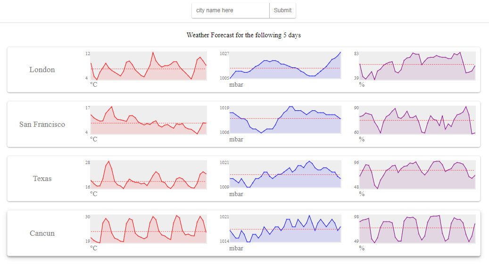

## React SparkLines Weather Demo

Little react project to use the openweather Api ( now called openweathermap.org ) to chart out the next 5 days of weather

- install dependecies
- go to openweathermap.org create an account and create an api key
- paste api key in src/App.js
- run project

## flow

- user types in name of city
- user submits
- app calls open weather appi where it gets something like this
